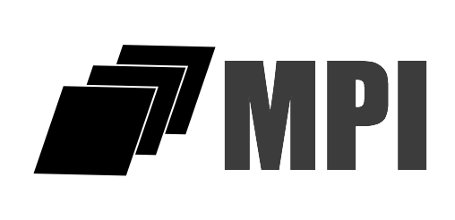
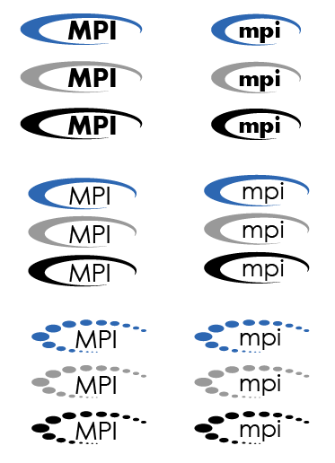

## Logo Finalists

### Logo Group 1

  

Comments:

*   Three interleaved parallelograms stands for parallel data movement
*   Blue shows stability and trustworthiness
*   Three different color depths coming into harmony means different opinions comes into a consensus; the color change also means continuously improvement on the standard

### Logo Group 2

  

  

  

  

### Logo Group 3

